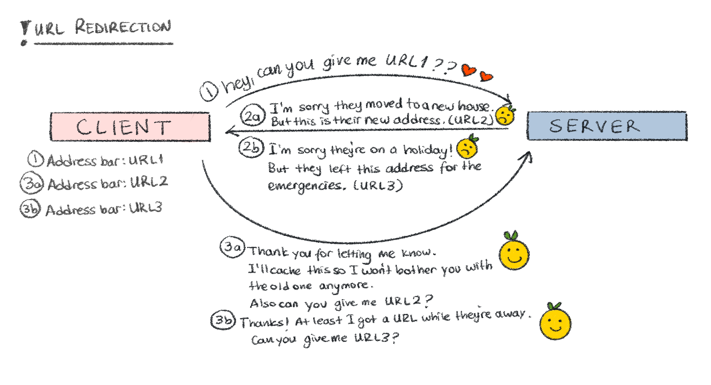
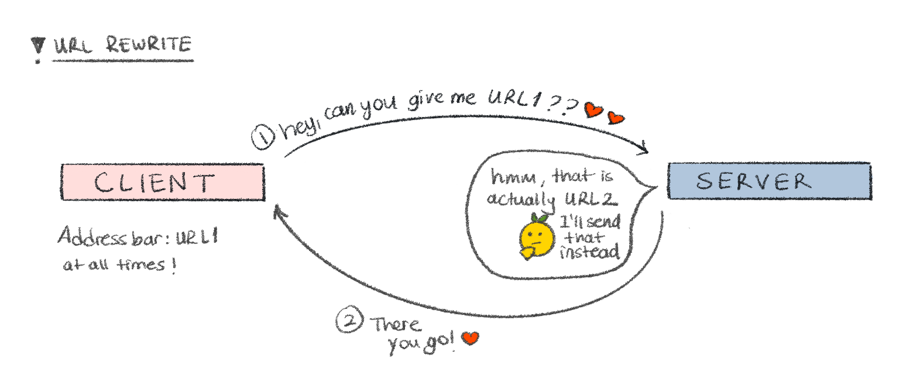

I've recently re-built this personal site using [Astro](https://astro.build/) (yes, the web framework—not the dog from The Jetsons), and I wanted some different routes to display the same page. The mighty [Astro docs](https://docs.astro.build/en/guides/routing/) told me there are two magical ways to do it: URL Redirects and URL Rewrites. This article briefly talks about the differences between these two approaches.

#### URL Redirection

  **"URL redirection"** (also known as **"URL forwarding"**), is a way to assign
  multiple URLs to a page, or to put in another way, to send users and sometimes
  search engines to a different URL than the one initially intended. It is
  simply the digital equivalent of saying, “Sorry, the content you're looking
  for moved to a new address.”

**<iconify-icon icon="mingcute:lollipop-line"></iconify-icon> URL Redirections are often used for:**

- **Domain aliasing:** for example, this site is available for both `https://www.yagmurcetintas.com/` and `yagmurcetintas.com`, because not everyone likes typing as much as I do.
- **Domain migrations:** if you're migrating your website to a new domain, it would make sense to redirect the old domain to the new one so existing links and bookmarks still open up correctly.
- **Changing the URL structure of your application:** it would make sense if the old path renders the same page as the new one to avoid broken links and keeping your users from wandering into 404-ville.
- **Security reasons, HTTP-to-HTTPS redirection:** redirect non-secure web pages to secure web pages, which you would definitely want, unless you're the type who has a false security sense and just don't like locking doors.

**<iconify-icon icon="mingcute:lollipop-line"></iconify-icon> How it works:**

Redirections happen with HTTP status codes, and they can be temporary or permanent:

- **Temporary:** 302 (Found), 303 (See Other), 307 (Temporary Redirect)
- **Permanent:** 301 (Moved Permanently), 308 (Permanent Redirect)

**<iconify-icon icon="mingcute:lollipop-line"></iconify-icon> Redirects can be set in 3 places:**

- **Server side:** Can be set in the server config files.
- **Client side:** Through HTML `<meta>` tags or JS (using [window.location](https://developer.mozilla.org/en-US/docs/Web/API/Window/location))
- **Framework-level:** Some frameworks let you define redirects in config files, like [Astro](https://docs.astro.build/en/guides/routing/#redirects).

**<iconify-icon icon="mingcute:large-arrow-right-fill"></iconify-icon> The story goes like this:**

1. The client requests for a URL from the server (URL1).
2. If there is a redirection that the server is aware of, the server responds with one of the redirect HTTP status codes depending on the nature of the redirection and puts the new location URL in its `Location` header (URL2). This is just to inform the client that the resource it is looking for is no longer in the URL it sent, but there's a new URL that contains the requested material.
3. Upon receiving the response from the server, the client makes a second request, this time requesting URL2.
4. The server responds with the content for URL2.

The HTTP code the client receives in step 2 is important because it tells the client if it should cache the new redirection location. For temporary redirection codes, the location is not cached unless stated otherwise with the relevant Cache-Control headers, meaning all requests to the old location will follow through the same flow explained above. Permanent redirections will be cached so the client browsers/search engine robots/RSS readers/proxy servers/any other crawlers know not to request the old location information anymore.

Server-side redirects are the most reliable way of doing redirections, but there are times when you don't have access to the servers. At this point you can use the [HTML redirections (meta tag)](https://developer.mozilla.org/en-US/docs/Web/HTTP/Guides/Redirections#html_redirections) or [JS redirections (`window.location` property)](https://developer.mozilla.org/en-US/docs/Web/HTTP/Guides/Redirections#javascript_redirections). According to MDN web docs, HTTP redirects are executed first, JS redirects are executed second, and HTML redirects execute last. Usage of HTML redirects (meta tags) for redirections are discouraged since the gold standard is the HTTP redirections and if used together (mainly because of forgotten meta tags) it could lead to hard-to-debug nightmares of infinite loops.

#### URL Rewrite

  URL rewriting is the sneakier cousin of URL redirection. It is the process of
  changing a URL behind the scenes—without changing the URL in the browser's
  address bar. Unlike URL redirection which is totally visible on the client
  side and on the address bar of the browser, a URL rewrite is invisible to the
  user. Basically the user asks for a specific URL, browser serves another one,
  and the URL in the address bar never changes.

**<iconify-icon icon="mingcute:lollipop-line"></iconify-icon> URL Rewrites are often used for:**

- **Pretty URLs:** Turn hideous URLs like `?id=234545` into something a human might actually want to click on, like `/products/hairbrush`
- **Hide server structure:** Protect internal paths (like `/internal/api/987`) from users, because exposing your API endpoints is like leaving your diary on the kitchen table during a house party
- **SEO and usability:** Legible URLs are better for humans (and search engines. But I will not advocate for them, since they're very capable of doing that themselves)
- **Localization or A/B testing:** Serve different content from the same URL path

**<iconify-icon icon="mingcute:lollipop-line"></iconify-icon> Rewrites can be set in 2 places:**

- **Server side:** Can be set in the server config files.
- **Framework-level:** Some frameworks let you define redirects in config files (or in their pages), like [Astro](https://docs.astro.build/en/guides/routing/#rewrites).

### Resources

1. [Mozilla - Redirections in HTTP](https://developer.mozilla.org/en-US/docs/Web/HTTP/Guides/Redirections) by Mozilla
2. [What is URL redirection?](https://www.logicbig.com/quick-info/web/url-redirection.html) by logicbig
3. [How to Redirect HTTP to HTTPS Using .htaccess?](https://www.clickssl.net/blog/redirect-http-to-https) by ClickSSL
4. [Astro docs](https://docs.astro.build/en/getting-started/)
5. [URL Rewrite vs. Redirect; What’s the difference?](https://prod-static-asp-blogs.azurewebsites.net/owscott/rewrite-vs-redirect-what-s-the-difference/) by Scott Forsyth
